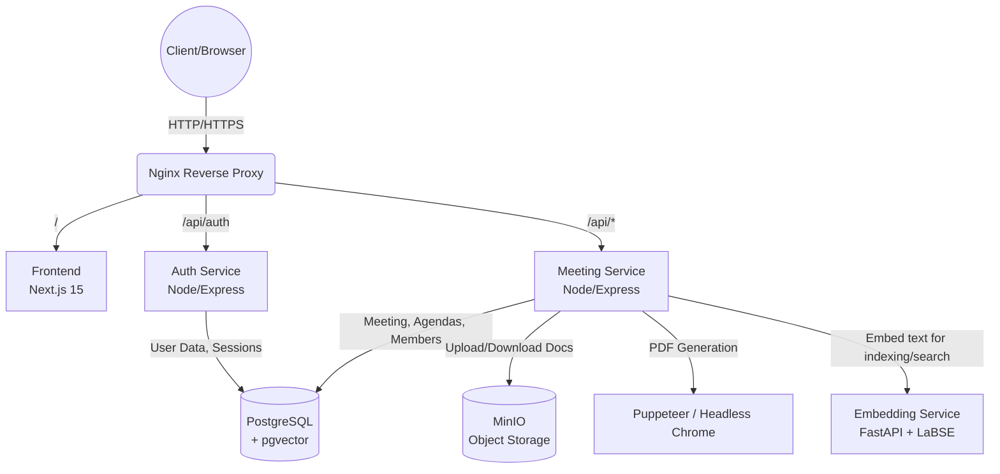

# BUET E-Council System Documentation

## 1. System Architecture

BUET E-Council is architected as a distributed microservices system to ensure scalability, robust isolation of concerns, and ease of deployment. 

### 1.1 High-Level Infrastructure Flow

### 1.2 Codebase Organization & Patterns

The repository is a monorepo organized into specialized directories representing independent domains:

#### `frontend/` (Next.js Application)
- **Pattern**: Next.js App Router (`app/` directory) with React Server Components (RSC) and Client Components.
- **State Management**: Uses SWR for client-side data fetching, caching, and revalidation.
- **Styling**: Tailwind CSS v4 coupled with CSS variables (`globals.css`) to enforce the BUET E-Council design system (maroon and slate themes).
- **Rich Text**: Integrates TipTap for a headless rich-text editing experience customized for agenda creation.

#### `auth_service/` (Node/Express Microservice)
- **Pattern**: Modular route handlers.
- **Responsibility**: Fully handles the user lifecycle. It issues secure, `HttpOnly` cookies, acting as the sole gatekeeper for identity. It does not contain domain logic for meetings.
- **Database Access**: Direct connections to PostgreSQL via a shared connection pool, handling its own subset of tables (`users`, `sessions`).

#### `meeting_service/` (Node/Express Microservice)
- **Pattern**: Model-View-Controller (MVC) adaptation (Controllers mapped to Routes).
- **Directory Structure**:
  - `routes/`: Express routers mapping endpoints to controller logic.
  - `controllers/`: Core business logic, executing raw parameterized SQL queries, handling transactions, and orchestrating external services.
  - `utils/`: Shared utilities (e.g., `storageService.js` for MinIO S3 SDK wrappers, `pdfGenerator.js` for driving Puppeteer).
- **Responsibility**: Manages all meeting operations, file uploads, PDF rendering, and complex multi-table SQL transactions (like the bulk JSON importer).

#### `db/` (Database Initialization)
- Contains `init.sql`, which bootstraps the PostgreSQL schema, custom Enums, tables, indexes, and seeds default institutional data (Faculties, Departments, default Admin) upon the first Docker initialization. There is no separate migrations directory — schema changes are made directly in `init.sql`.

#### `embedding_service/` (Python/FastAPI Microservice)
- **Pattern**: A single stateless endpoint wrapping `sentence-transformers/LaBSE` (768-dim, multilingual incl. Bengali).
- **Responsibility**: `POST /embed` turns a batch of texts into embedding vectors; used by `meeting_service` to index agenda/resolution content and to embed search queries at request time. Never talks to the database itself and isn't reachable from outside the Docker network.

#### `nginx/` (API Gateway / Reverse Proxy)
- Acts as the single entry point. It strips SSL (if configured), serves static assets for the frontend if necessary, and routes `/api/auth` traffic to the Auth Service and all other `/api/` traffic to the Meeting Service, circumventing CORS complexity for the client.

---

## 2. Database Entities

The application uses a PostgreSQL database. Below is a detailed explanation of every entity (table) in the database schema:

1. **`users`**: Manages all accounts in the system. Stores `username`, `email`, hashed `password`, `role` (`admin`, `moderator`, `member`), `member_type`, and `status`.
2. **`sessions`**: Tracks active authenticated sessions for users. Includes `session_token`, `device_info`, `ip_address`, `signin_location`, and an `expires_at` timestamp.
3. **`faculties`**: Represents the main academic faculties at BUET. Stores `name_bangla` and `name_english`.
4. **`departments`**: Represents the departments under faculties. Includes `name_bangla`, `name_english`, and their aliases (short forms), linked to a `faculty_id`.
5. **`offices`**: Represents administrative or designated offices. Stores `name_bangla` and `name_english`.
6. **`members`**: Central roster of potential meeting participants. Stores their `name`, `designation`, linked `department_id` or `office_id`, and `email`.
7. **`meetings`**: The core operational entity. Stores meeting `title`, `description`, `president`, scheduled `meeting_date`, `type` (academic/syndicate), document links (PDFs), and overall `status` (`draft`, `ongoing`, `past`, `locked`).
8. **`agenda`**: Stores the items discussed in a meeting. Holds rich-text `content` (agenda text), `resolution` (decisions made), execution tracking (`is_executed`, `execution_status`), plain-text mirrors (`content_plain`, `resolution_plain`) and generated `tsvector` columns used for full-text search.
9. **`tags`** / **`agenda_tags`**: User-facing labels attachable to agenda items; `agenda_tags` is the join table.
10. **`agenda_chunks`** / **`resolution_chunks`**: Chunked plain-text + `vector(768)` LaBSE embeddings of agenda/resolution content, used for semantic search.
11. **`search_cache`**: Caches search results by a hash of the query + filters; wiped whenever agenda/resolution content is re-indexed.
12. **`templates`**: A repository of reusable text snippets (e.g., standard agenda formatting). Tracks `visibility` (`public`/`private`), `type`, and `used_count`.
13. **`invitees`**: A pivot/tracking table representing people invited to a specific meeting. Links to `meetings` and includes attendance flags (`is_present`).
14. **`presentees`**: A localized list of confirmed attendees for a specific meeting, linked to `departments`/`offices`.
15. **`revisions`**: Audit trail capturing prior versions of `agenda.content`/`agenda.resolution`, with a history view and restore exposed via the API.
16. **`annexures`**: Attachments related to agenda items or resolutions. Stores the MinIO `file_path` and `summary`.

---

## 3. Backend Routes & Functions - Developer Deep Dive

The backend is split into two microservices (`auth_service` and `meeting_service`). The routes map directly to controller functions which handle parameter validation, execute raw parameterized SQL queries (via the `pg` library), and return standard JSON responses.

### 3.1 Auth Service (`/api/auth`)

The Auth Service manages identity, credentials, and stateful sessions.

#### Authentication & Sessions
- **`POST /signup`**: Parses `username`, `email`, and `password`. Uses `bcrypt.genSalt(10)` and `bcrypt.hash()` to encrypt the password. Inserts into the `users` table returning the `id` and `role`. Handles `409` conflicts if username/email exists.
- **`POST /signin`**: Extracts credentials and device info. Looks up the user by `username` or `email`. Uses `bcrypt.compare()` to validate. Upon success, generates a 64-byte hex token (`crypto.randomBytes(64)`), inserts a new row into `sessions` with a 30-day expiry (`expires_at`), and sets an `HttpOnly`, `SameSite=strict` secure cookie for the Next.js frontend.
- **`POST /signout`**: Requires the `requireAuth` middleware. Uses the token extracted from the request cookie to `UPDATE sessions SET is_active = FALSE`. Clears the `session_token` cookie.
- **`POST /signout-all`**: Similar to signout, but invalidates *all* sessions for `req.user.id` by setting `is_active = FALSE` across the board.
- **`GET /sessions`**: Queries the `sessions` table where `user_id = $1 AND is_active = TRUE AND expires_at > NOW()`. Flags the session matching the current request cookie as `is_current: true`.
- **`DELETE /sessions/:sessionId`**: Terminates a specific remote session by updating its `is_active` flag. Validates that users cannot delete their *current* session through this endpoint (enforced via HTTP 403).

#### User Management (Admin restricted via `requireAdminOrModerator`)
- **`GET /users`**: Fetches all rows from `users` ordering by `created_at DESC` (omits passwords).
- **`PUT /users/:id`**: Dynamically builds an `UPDATE` query array based on which fields (`username`, `email`, `role`, `status`) are provided in the payload to avoid overwriting unpassed fields. Hashes the new password if provided.
- **`POST /upload-csv`**: Implements bulk user creation. Uses `multer` (memoryStorage) and `csv-parser` to stream a `.csv` file. Executes inside a SQL transaction (`BEGIN`/`COMMIT`/`ROLLBACK`). Hashes passwords on-the-fly and skips existing usernames using `ON CONFLICT DO NOTHING`.
- **`GET /download-csv`**: Fetches the user list, parses it into CSV format using `json2csv`, and sends it with `Content-Type: text/csv` as an attachment.
- **`PUT /me`**: User self-service profile update. Allows changing the email (with duplicate checks) and password (requires validating the `currentPassword` hash before updating).

### 3.2 Meeting Service (`/api/*`)

Handles all domain logic for E-Council meetings. Employs transaction blocks for complex mutations.

#### Agenda Controller (`/api/agenda`)
- **`getAgendams`**: Queries the `agenda` table. If `meeting_id` is provided, filters by it and sorts by `agenda_serial ASC`. Can also filter by `is_suppli` (boolean). Each row includes its `tags` (via a `json_agg` over `agenda_tags`/`tags`).
- **`createAgendam`**: Basic insert into `agenda` expecting `meeting_id`, `content`, `agenda_serial`, `is_suppli`, and optional `tag_ids`. Defaults `is_executed` to 'no'. After responding, fires off (fire-and-forget) search indexing for the new content.
- **`updateAgendam`**: Uses `COALESCE` in the SQL `UPDATE` to safely patch only the fields provided in the body (`agenda_serial`, `content`, `is_executed`, `tag_ids`). If `content` changes, the previous value is snapshotted into `revisions` first, and search indexing is re-triggered afterward.
- **`deleteAgendam`**: Deletes an agenda item by ID. **Critical Logic**: Wrapped in a transaction. After deleting the target, it recalculates and updates the `agenda_serial` for all remaining main and supplementary agendas for that meeting to prevent sequence gaps. Also clears `search_cache`.
- **`getResolutions`**: Fetches agendas where the `resolution` column is `NOT NULL`.
- **`createResolution` / `updateResolution`**: Updates the `resolution` text column on a specific agenda row, snapshotting the previous value into `revisions` first and re-indexing for search afterward.
- **`updateExecutionStatus`**: Modifies the `is_executed` and `execution_status` columns.
- **`deleteResolution`**: Sets `resolution`/`resolution_plain` to `NULL` and clears the corresponding `resolution_chunks`.
- **`getRevisions`**: `GET /:id/revisions?content_type=agendaItem|resolutionItem` — lists prior versions of an agenda's content or resolution, newest first, joined to `users` for a display name.
- **`restoreRevision`**: `POST /:id/revisions/:revisionId/restore?content_type=...` — snapshots the current value (so it isn't lost) then restores the chosen historical version and re-indexes it.
- **`getAnnexures` / `uploadAnnexure` / `deleteAnnexure` / `reorderAnnexures`**: `uploadAnnexure` streams `req.file` buffer to MinIO via AWS SDK S3 client (`storageService.js`) generating a unique random hex key. Saves the key path to the database. `getAnnexures` dynamically constructs a `/storage/...` presigned-like URL for the frontend. `reorderAnnexures` loops over an array in a transaction to update `annexure_serial`.

#### Tag Controller (`/api/tags`)
- **`getTags`**: Lists all tags. **`createTag`**: Creates a tag, or returns the existing one if the name already exists (`ON CONFLICT DO UPDATE ... RETURNING *`).

#### Search Controller (`/api/search`)
- **`search`**: `GET /api/search?q=&scope=agenda|both&tags=id1,id2&dateFrom=&dateTo=`. Checks `search_cache` first (keyed by a hash of the query + filters) for an instant response. Otherwise runs three prioritized buckets and concatenates them: (1) **keyword** — Postgres full-text search (`websearch_to_tsquery('simple', ...)`) over `content_tsv`/`resolution_tsv` with an `ILIKE` fallback; (2) **entity** — trigram-matches the query against `departments`/`offices`/`members`, then re-runs the keyword search using the matched entity's canonical names/aliases; (3) **semantic** — embeds the query via the `embedding_service` (LaBSE) and does a cosine-similarity search over `agenda_chunks`/`resolution_chunks`. Results are cached in `search_cache`, which is wiped on every agenda/resolution write so results never go stale.

#### Meeting Controller (`/api/meetings`)
- **`getMeetings`**: Fetches all meetings ordered by `created_at DESC`, attaching a `ROW_NUMBER()` over the partition to act as a serialized counter for the frontend.
- **`createMeeting` / `updateMeeting`**: Standard parameterized inserts/updates handling fields like `title`, `meeting_date`, and `type`.
- **`deleteMeeting`**: Deletes a meeting (cascades down to agendas and invitees automatically via SQL schema constraints).
- **`bulkFetchInvitees`**: An optimized bulk insert. Using `INSERT INTO ... SELECT`, it fetches members whose `member_type` matches the `meeting.type` and inserts them into the `invitees` table, filtering out duplicates via `NOT EXISTS`. Wrapped in a transaction.
- **`addInvitees` / `getInvitees` / `updateInvitee` / `removeInvitee`**: Manages the `invitees` pivot table. `getInvitees` performs `LEFT JOIN`s on `departments` and `offices` to hydrate the response with readable names.
- **`completeMeeting`**: **Critical State Transition**: Validates the payload `title`. Inside a transaction, updates the meeting status to `past`. Migrates all invitees marked as `is_present = true` into the permanent `presentees` table, then deletes all rows for that meeting from the `invitees` table to clear temporary data.
- **`generatePdf`**: Based on the `type` parameter ('agenda', 'resolution', 'attendance'), it invokes the `pdfGenerator.js` module. This module launches a `puppeteer-core` instance, injects raw HTML with inline CSS styling (including `@font-face` for Sonar Bangla), renders it into a buffer, and serves it as an `application/pdf` attachment.
- **`uploadMaterial`**: Generic endpoint to upload final compiled PDFs directly linking them to `agenda_pdf_link` or `resolution_pdf_link` columns on the `meetings` table.
- **`toggleLock`**: Reverses the `is_locked` boolean on a meeting. Enforces an application-level check that `req.user.role === 'admin'`.
- **`bulkImportMeeting`**: Extremely complex transactional route. Takes a JSON payload containing `meeting`, `presentees` (array), and `agendas` (array). Opens a SQL `BEGIN` block, creates the meeting, retrieves the new `meetingId`, iterates over presentees to insert them mapping to departments, iterates over agendas to insert them, and finally runs `COMMIT`.

#### Other Controllers (Departments, Faculties, Offices, Templates, Members)
- **CRUD Operations**: All standard lookup tables provide `GET`, `POST`, `PUT`, `DELETE`.
- **Reordering**: Controllers for structural entities expose a `reorder` function taking an array of `{ id, serial }` objects, iterating over them inside a SQL `BEGIN/COMMIT` transaction block to bulk-update sequence numbers safely.
- **CSV Import/Export**: Similar to users, they stream `csv-parser` to batch-insert structural data inside SQL transactions, mapping Bengali and English names. They use `json2csv` for exports.
- **`fetchExternalMembers`**: Specialized query logic in `membersController.js` to retrieve members not strictly bound to an academic department.

---

## 4. Frontend Pages (Next.js)

The frontend is built with Next.js App Router (`app/` directory). Here is the mapping of every page and its purpose:

### 4.1 Public & User Pages
- **`/login`**: The authentication page for users to sign in.
- **`/` (Home)**: The default dashboard for logged-in users, displaying an overview of recent or upcoming meetings.
- **`/profile`**: Allows users to view and edit their personal profile information and update passwords.
- **`/profile/sessions`**: A security dashboard showing all active logins for the user across different devices, with the ability to revoke them.
- **`/meetings/[id]`**: A read-only, user-facing view of a specific meeting's details, agenda, and resolutions. Accepts `?highlight=<agendaId>&type=agenda|resolution` to scroll to and briefly highlight a specific item (used by search result links).
- **`/search`**: Keyword, entity, and semantic search across agenda/resolution content, with filters for date range, tags, and scope (agenda only vs. agenda + resolution). Reachable via the search box in the header.

### 4.2 Administrative Pages (`/admin/*`)
These pages are restricted to users with `admin` or `moderator` roles.

- **`/admin`**: The main admin dashboard offering high-level metrics and system overviews.
- **`/admin/meetings`**: A table listing all meetings in the system with the ability to create new ones or initiate a JSON bulk import.
- **`/admin/meetings/[id]`**: The comprehensive meeting management workspace. Here, admins build the agenda using the TipTap rich-text editor, manage invitees, record attendance, and trigger PDF generation.
- **`/admin/users`**: User management console for creating accounts, changing roles, and importing users via CSV.
- **`/admin/departments`**: Dashboard for managing the list of academic departments.
- **`/admin/faculties`**: Dashboard for managing the university's faculties.
- **`/admin/offices`**: Dashboard for managing administrative offices.
- **`/admin/members`**: Management interface for the central roster of people who can be invited to meetings.
- **`/admin/templates`**: Workspace for creating and organizing reusable rich-text blocks (templates) used during meeting creation.

---

## 5. Security & Deployment

- **Cookies**: Session state is managed via secure, HttpOnly cookies protecting against XSS attacks.
- **Role-Based Access Control (RBAC)**: Enforced both on the UI (conditional rendering of admin navigation) and at the API layer (middleware intercepting unauthorized requests).
- **Docker Compose**: The entire stack is orchestrated via `docker-compose`, initializing the database with the schema natively and warming up the MinIO buckets automatically using an initialization container.
